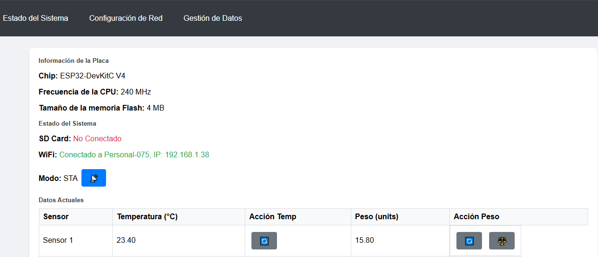
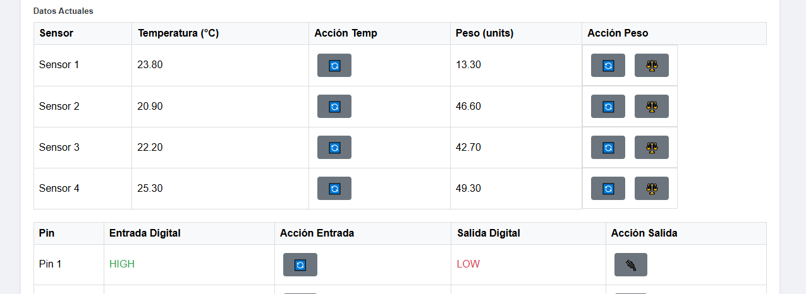
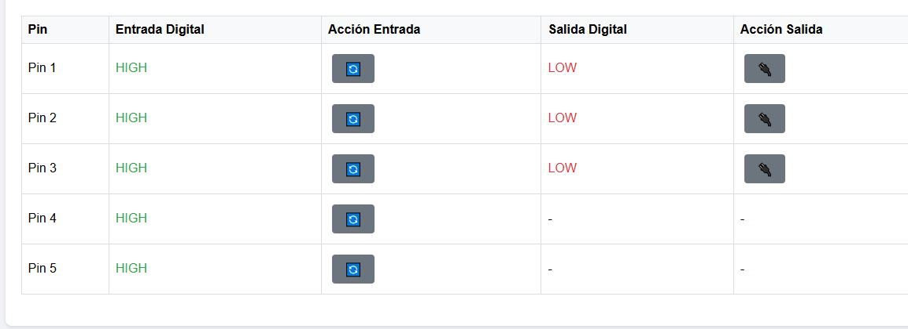
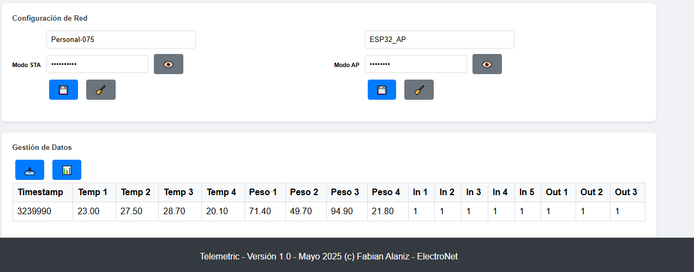

# IMPORTANTE: 
Este proyecto es totalmente gratuito, funcional y de codigo abierto, puedes usarlo y modificarlo como quieras bajo tu propia responsabilidad, solo pido una pequeña mención si lo usas para fines comerciales y/o educativos, lo que no significa que cobraré regalías por el mismo, pero puede invitarme un café si lo deseas, ni Hugo Fabian Alaniz ni ElectroNet no son ni seran responsables de los daños que pueda causar este codigo ni de la exposicion que se haga del mismo, usalo con responsabilidad!

# Descripción del proyecto:
Es un proyecto para un ESP32 que configura un servidor web, lee sensores (temperatura, peso con HX711, entradas/salidas digitales), almacena datos en una tarjeta SD y permite gestionar configuraciones de red (modo STA/AP) a través de una interfaz web. Utiliza EEPROM para almacenar configuraciones y tiene una interfaz HTML con funcionalidades como mostrar datos en tiempo real, descargar datos históricos y alternar modos de red.

# 1. Hardware Necesario
## ESP32 DevKit V1 (ESP32 Pinout).

Sensores de temperatura (ej. LM35 o DS18B20) x4.

Celdas de carga con HX711 (para peso) x4.

Entradas digitales (botones o sensores) x7.

Relés o salidas digitales controladas x7.

Módulo SD Card (SPI).

Fuente de alimentación adecuada (3.3V/5V según sensores).

# 2. Asignación de Pines (basado en ESP32 Pinout)
### Entradas analógicas (temperatura): ADC1 (8 canales disponibles, usaremos 4).
GPIO36 (VP), GPIO39 (VN), GPIO32, GPIO33.

### Entradas analógicas (peso, HX711): HX711 usa pines digitales, no ADC.
HX711_1: DT=GPIO25, SCK=GPIO26.

HX711_2: DT=GPIO27, SCK=GPIO14.

HX711_3: DT=GPIO12, SCK=GPIO13.

HX711_4: DT=GPIO15, SCK=GPIO2.

### Entradas digitales: Usar pines con pull-up/pull-down.
GPIO4, GPIO5, GPIO18, GPIO19, GPIO21, GPIO22, GPIO23.

### Salidas digitales: Pines para relés o LEDs.
GPIO16, GPIO17, GPIO34, GPIO35, GPIO0, GPIO1 (TX), GPIO3 (RX).

### SD Card (SPI):
MISO: GPIO19, MOSI: GPIO23, SCK: GPIO18, CS: GPIO5.

WiFi/WebServer: Interno en ESP32.

## Notas:
Evita pines como GPIO6-11 (usados por flash SPI).

GPIO34, 35, 36, 39 son solo entrada, ideales para ADC.

Asegúrate de que las salidas digitales soporten la corriente de los relés.

# 3. Código Principal (Arduino IDE)
  Código en el archivo ControlEsp32.ino

# 4. Explicación del Código
## Librerías:
WiFi, WebServer: Para crear un servidor web.

SD, SPI: Para guardar datos en la SD.

HX711: Para las celdas de carga.

ArduinoJson: Para enviar datos en formato JSON.

Setup:
Inicializa SD, HX711, pines digitales y WiFi.

Configura rutas del servidor (/ para página principal, /data para JSON).

Loop:
Maneja solicitudes del servidor.

Lee sensores y guarda datos en la SD cada segundo.

Funciones:
readSensors(): Lee temperaturas (ADC), pesos (HX711), entradas y salidas digitales.

saveToSD(): Guarda datos en un archivo CSV en la SD.

handleRoot(): Página web básica.

handleData(): Responde con datos en JSON.

# 5. WebApp
La WebApp es una página simple que se ejecuta en el navegador al acceder a la IP del ESP32. Para mejorarla:
Usa JavaScript/AJAX para actualizar datos dinámicamente desde /data.

Ejemplo de mejora para handleRoot():

# 6. Pasos para Implementar
## Conectar hardware:
Conecta sensores según pines asignados.

Usa resistencias pull-up/pull-down si es necesario.

## Instalar librerías:
En Arduino IDE: WiFi, WebServer, SD, SPI, HX711, ArduinoJson.

## Configurar código:
Ajusta ssid, password.

Calibra HX711 (set_scale, tare) según tus celdas de carga.

Ajusta conversión de temperatura según sensor (LM35 en el ejemplo).

## Probar:
Carga el código y abre el Monitor Serial para ver la IP.

Accede a la IP desde un navegador (ej. 192.168.1.X).

Verifica que los datos se guarden en la SD.

# 7. Consideraciones
## Almacenamiento SD: Asegúrate de formatear la SD en FAT32.

## Consumo energético: Usa un regulador de voltaje adecuado para sensores.

## Seguridad: Agrega autenticación al servidor web si es necesario.

## Escalabilidad: Si necesitas más entradas/salidas, considera multiplexores o un ESP32 con más pines.

# 8. Depuración
Usa Serial.print para verificar lecturas de sensores.

Comprueba la conexión WiFi y el estado de la SD.

Valida el JSON en /data con un navegador o Postman.

# 9. Correcciones al código:
Probar la interfaz web:
## Modo STA:
Conecta a TuSSID y accede a http://192.168.1.XX (revisa la IP en el monitor serie).

### Navbar:
Verifica que los enlaces (Estado del Sistema, Configuración de Red, Datos de Sensores, Gestión de Datos) se muestren horizontalmente en pantallas grandes (>991px).

Confirma que están alineados a la derecha (ms-auto) y no apilados verticalmente.

La navbar debe tener fondo oscuro (#343a40), texto blanco, y altura compacta (~60px).

### Contenido:
Al cargar, solo se muestra Estado del Sistema (Información del Controlador + Datos Actuales).

Desplaza hacia abajo; asegura que todo el contenido (hasta el footer) sea visible sin recortes.

Haz clic en cada enlace de la navbar:
Configuración de Red: Muestra el formulario con SSID/password, botones "".

Datos de Sensores: Muestra temperaturas/pesos, botones "Tara".

Gestión de Datos: Muestra botones "Descargar Datos"/"Ver Datos Históricos".

Estado del Sistema: Vuelve a la pantalla principal.

Verifica que el enlace activo se resalte (background-color: #495057).

## Móviles (≤991px):
Haz clic en ☰ (menú hamburguesa); los enlaces deben apilarse verticalmente.

Selecciona una sección; el menú debe cerrarse y la sección aparecer.

## Pruebas:
Botones "Tara": Coloca un peso, haz clic, verifica 0.00.

Botones "Alternar": Confirma cambio de salidas (HIGH/LOW).

Configuración de red: Usa "", guarda cambios, verifica alert.

Gestión de datos: Descarga /data.txt, visualiza datos históricos.

## Modo AP:
Cambia a modo AP (clic en "Cambiar a AP" o reinicia con forceAPMode = true).

Conecta a ESP32_AP (contraseña: 12345678) y accede a http://192.168.X.X, revisa la IP en el monitor serie de Arduino IDE.

## Navbar:
Confirma que los enlaces se muestren horizontalmente en pantallas grandes, como antes.

Verifica alineación a la derecha, fondo #343a40, texto blanco.

## Contenido:
Igual que STA: Solo Estado del Sistema al cargar, otras secciones ocultas.

Navega entre secciones; verifica visibilidad y resaltado de enlaces.

Todo el contenido (hasta el footer) debe ser visible.

## Móviles:
Menú (☰) debe apilar enlaces verticalmente y cerrarse al seleccionar.

## Pruebas:
Igual que STA: Tara, salidas, configuración de red, datos históricos.

## Comparación:
La navbar debe verse idéntica en ambos modos (horizontal en pantallas grandes, colapsada en móviles).

Colores (#343a40, #007bff), márgenes, y disposición consistentes.

## Verificar el hardware:
### HX711: Sensores en {{23, 22}, {27, 14}, {12, 13}, {15, 21}}.

### DIGITAL_OUT: LEDs en {16, 17, 19, 18, 27, 33, 32}.

### DIGITAL_IN: Interruptores en {4, 13, 5, 34, 35, 36, 39}.

### TEMP_PINS: Sensores en {32, 33, 34, 35}.

### SD: Tarjeta FAT32 en CS (5), MOSI (23), MISO (19), SCK (18).

### Alimentación: USB 1A o 5V externa con capacitor de 100 µF.

